# Anleitung

**Entnervte Eule / Obnoxious Owl**

## Bauteile 

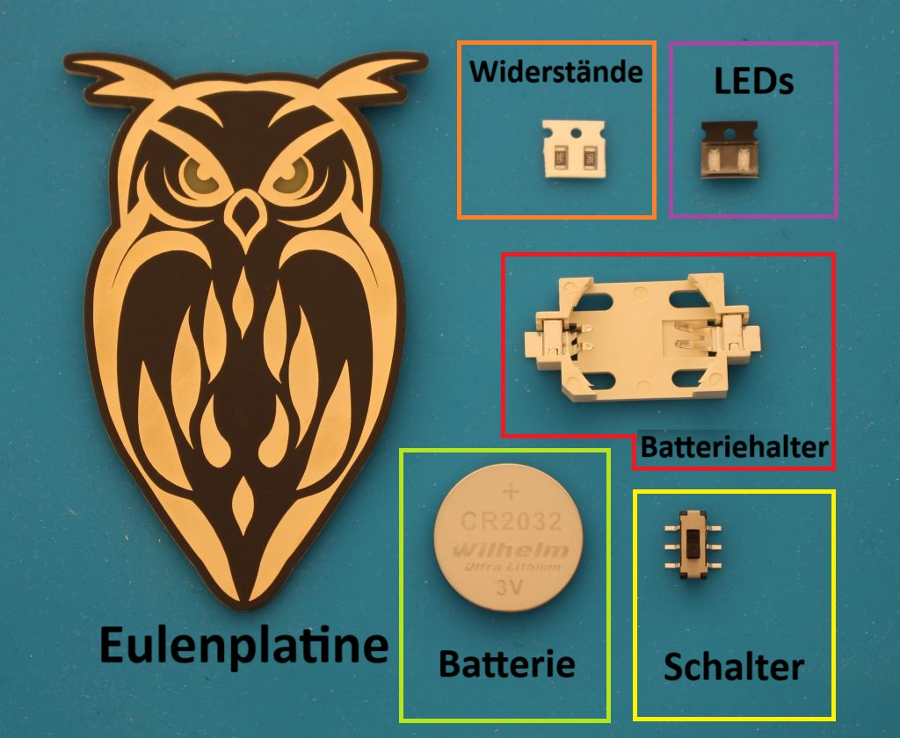

- 1x Eulenplatine in Silber/Weiß oder Gold/Schwarz
- 1x Batteriehalter
- 1x Batterie (CR2032 Knopfzelle, 3 Volt)
- 1x Schalter (An-Aus)
- 2x LEDs (verschiedenen Farben möglich)
- 2x Widerstände mit den passenden Werten zu den LEDs

## Benötigte Werkzeuge
- Lötkolben
- Lötzinn
- Pinzette

## Wo kommt was hin?

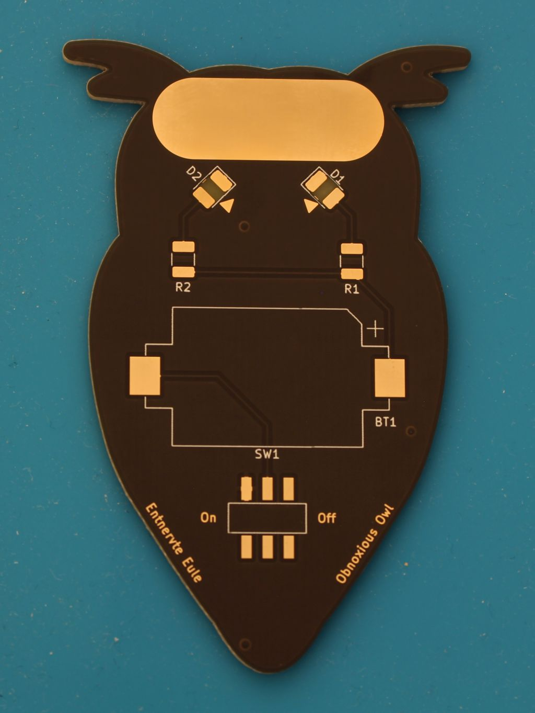

| Beschriftung         | Bauteil        |
| :------------------- | :----------    |
| D1/D2                | LEDs           |
| R1/R2                | Widerstände    |
| BT1                  | Batteriehalter |
| SW1                  | Schalter       |

## Auswahl der LEDs und passende Widerstände

LEDs brauchen je nach Farbe unterschiedliche Spannungswerte. Da unsere Batterie immer 3 Volt ausgibt, müssen wir die Spannung mithilfe von Widerständen anpassen.

Passend zu den LED-Farben im Set sind die richtigen Widerstände schon dabei. 

| LED Farbe   | Widerstand  |
| :---------- | :---------- |
| Rot         | 82 Ω        |
| Grün        | 56 Ω        |
| Gelb        | 47 Ω        |
| Blau        | 5,6 Ω       |
| Bunt        | 0 Ω         |

Wenn deine Eule Augen mit unterschiedlichen Farben haben soll, kein Problem: Komm zu uns. Wir suchen dir die richtige Farbkombination heraus.

## Schritt 1
### Widerstände löten (R1, R2)

Zuerst musst du eine Lötstelle vorverzinnen.
Halte hierfür deinen Lötkolben auf die obere Lötstelle und führe dann langsam Lötzinn hinzu.

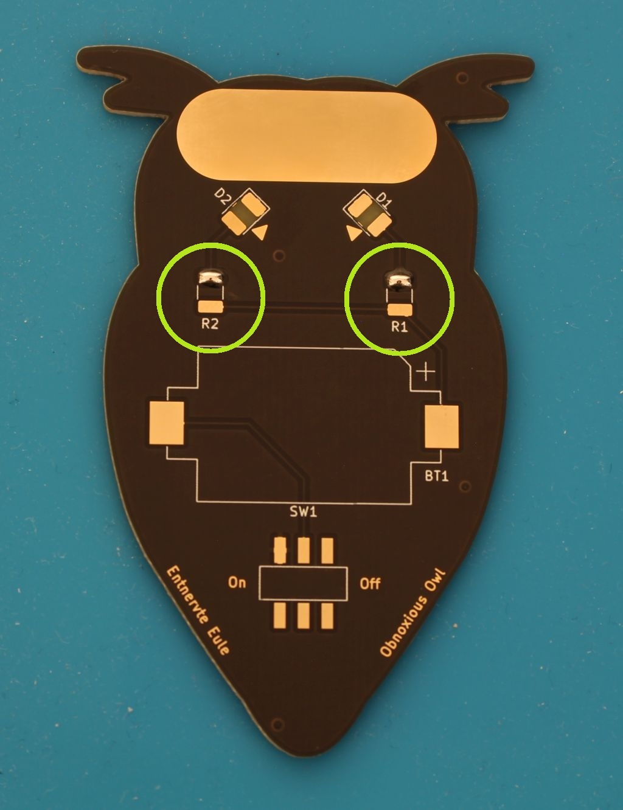

Bei den Widerständen musst du nicht drauf achten, wie herum sie gedreht sind. Nimm den Widerstand mit einer Pinzette auf. Mit dem Lötkolben in der anderen Hand erhitzt du nochmal das Lötzinn auf der vorverzinnten Stelle.
Wenn das Zinn flüssig ist, schiebst du den Widerstand in Position. 

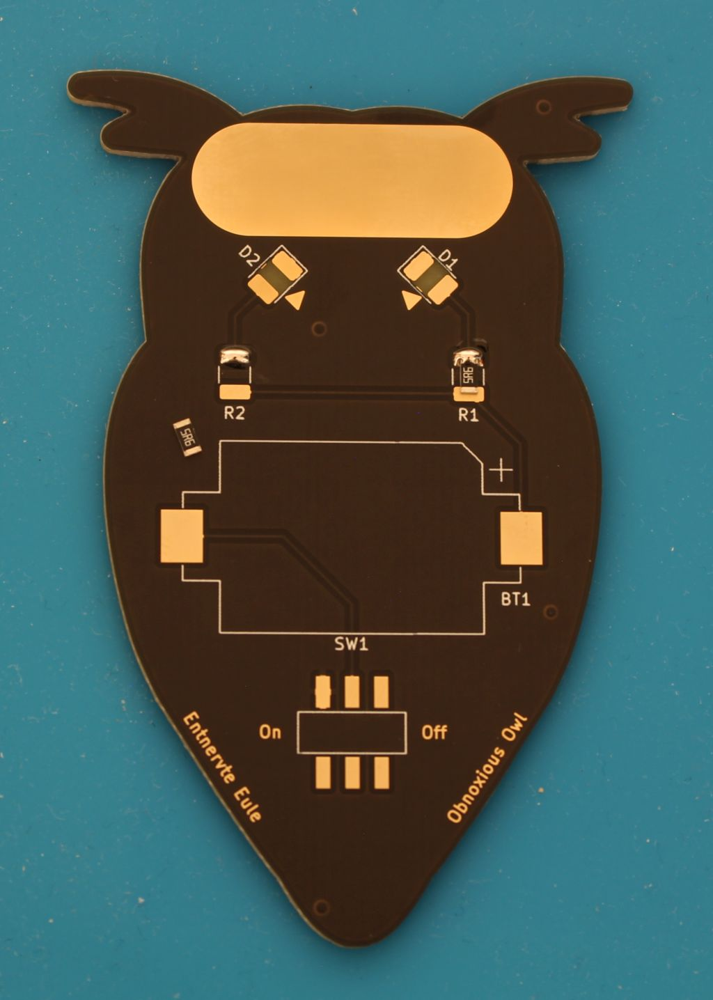

Anschließend lötest du noch die andere Seite des Widerstands fest.

Beim zweiten Widerstand machst du es genauso nochmal.

## Schritt 2

### LEDs löten (D1, D2)

Zuerst solltest du wieder eine Lötstelle vorverzinnen.

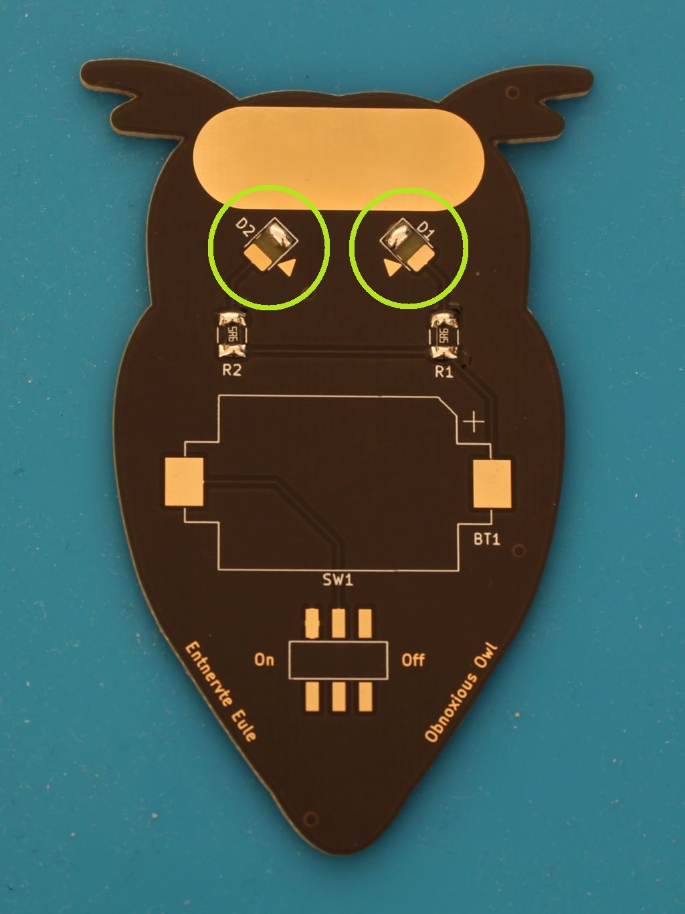

**Wichtig! Die LEDs haben eine Polung (Richtung). Deshalb musst du darauf achten, sie richtig herum einzulöten. Der Pfeil auf der LED (bzw. das T bei einigen LEDs) muss in die selbe Richtung zeigen wie der Pfeil auf der Platine!**

Du musst die LEDs außerdem mit dem Glaskörper nach unten festlöten. Später soll das Licht auf der anderen Seite der Platine zu sehen sein. 

Wie schon bei den Widerständen nimmst du die LED mit der Pinzette. Mit dem Lötkolben erhitzt du nochmal die verzinnte Lötstelle. Achte auf die Richtung der LED!
Wenn die LED fest ist, lötest du wieder den anderen Pin fest.

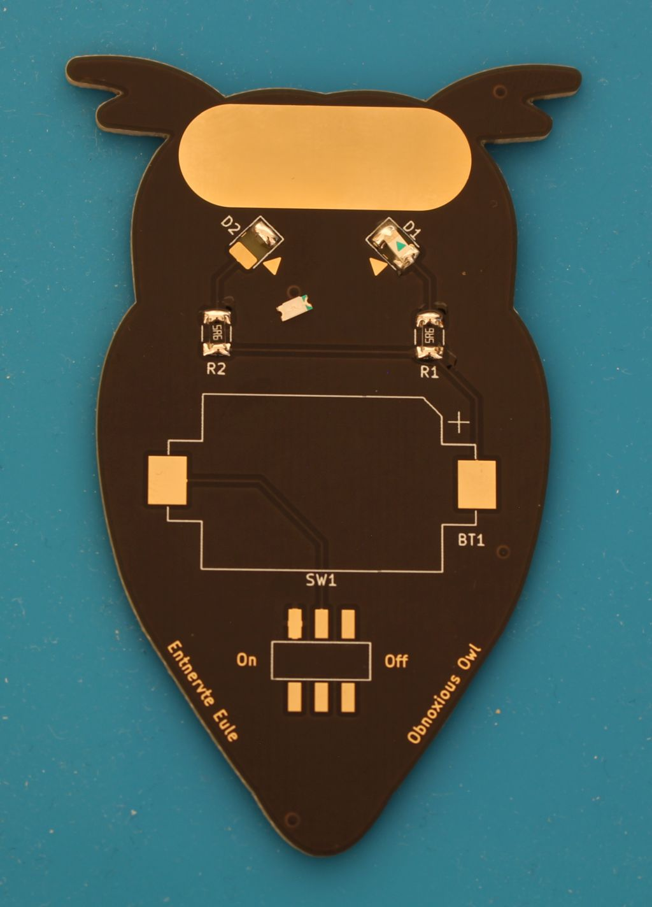

Das Ganze wiederholst du mit der zweiten LED.

## Schritt 3

### Schalter löten

Den Schalter lötest du genau wie die anderen Teile. Zuerst musst du wieder vorverzinnen. Wie immer erstmal nur eine Lötstelle.

Du nimmst den Schalter dann mit der Pinzette, erhitzt das Zinn und schiebst das Beinchen in das flüssige Zinn. Achte darauf, dass die anderen Beinchen des Schalters richtig auf den Pads (Lötstellen) liegen.

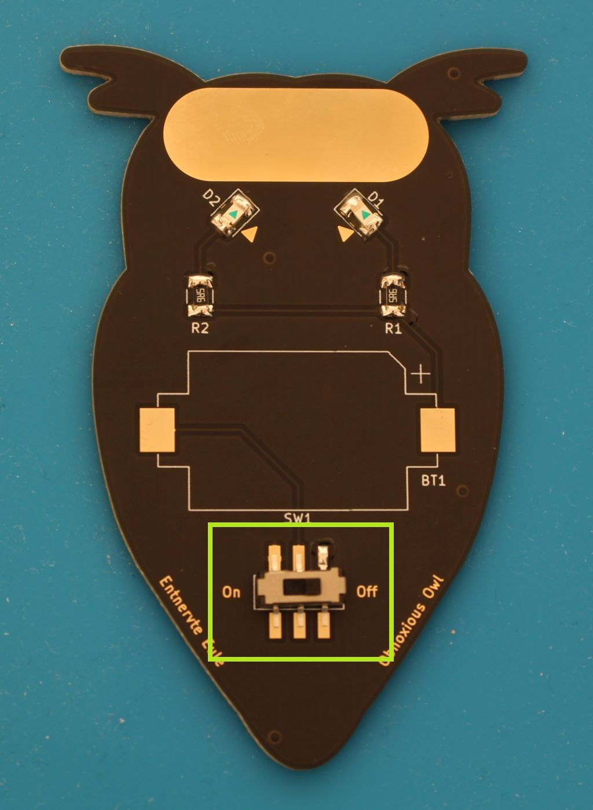

Wenn du den Schalter wie beschrieben befestigt hast, lötest du noch die restlichen Beinchen fest.

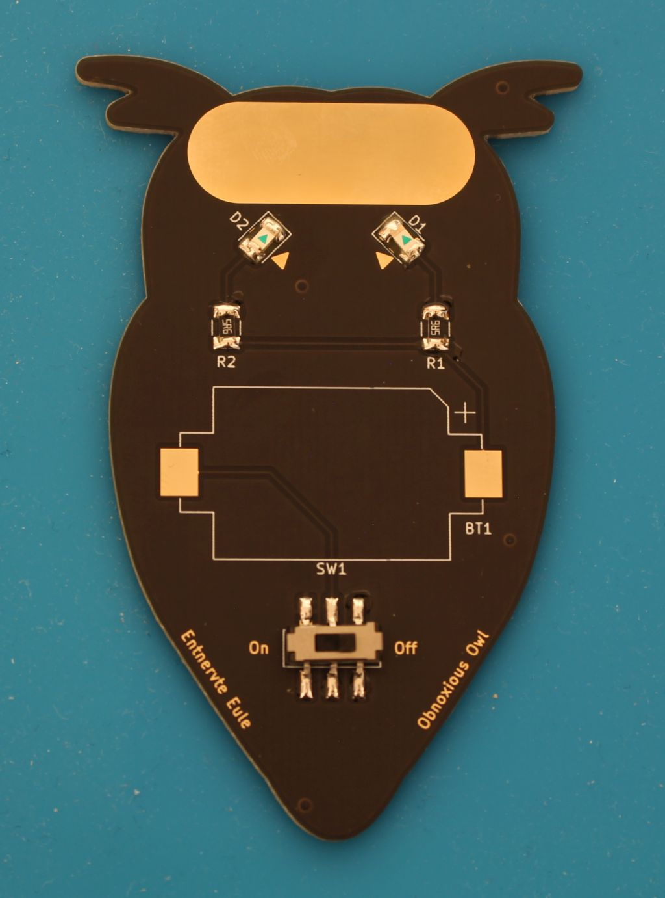

## Schritt 4
### Batteriehalter löten

Auch hier musst du die Lötstelle wieder vorverzinnen.

**Wichtig! Achte auf die Orientierung des Batteriehalters. Die Abkantung des Batteriehalters muss mit dem Aufdruck übereinstimmen. Wie schon die LED hat auch eine Batterie eine Polung (Plus und Minus).**

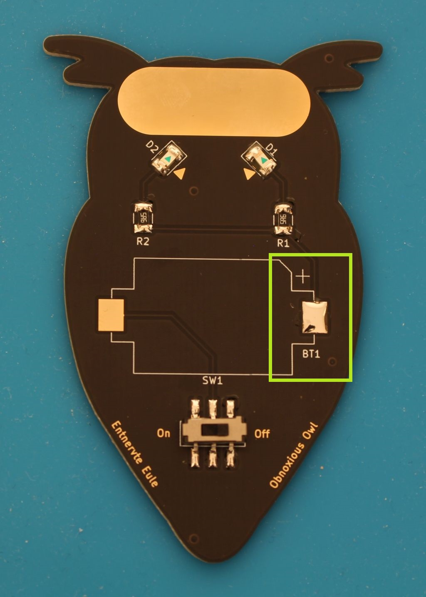

Jetzt erhitzt du mit dem Lötkolben die verzinnte Lötstelle und
schiebst den Batteriehalter darauf. Da die Lötstelle sehr groß ist, ist es hilfreich, die Spitze des Lötkolbens eher flach aufzusetzen. 

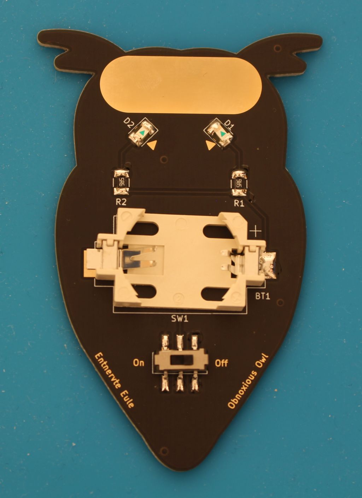

Jetzt noch die andere Seite festlöten und du hast es geschafft!

## Schritt 5
### Batterie einsetzen und Testen

Jetzt bist du fertig mit dem Löten. Allerdings brauchst du noch eine Spannungsquelle, bevor die Eule funktioniert. Bei der Batterie musst du darauf achten, sie richtig herum einzusetzen. Die Seite mit dem "+" und der Schrift muss nach oben zu dir zeigen.

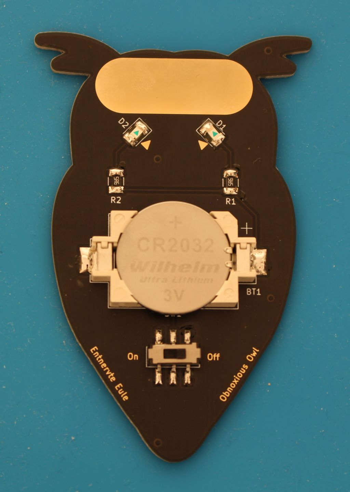

Wenn die Batterie eingebaut ist, kannst du die Eule mit dem Schalter einschalten. Im besten Fall fangen jetzt ihre Augen an zu leuchten. Toll gemacht! 

Wenn deine Eule nicht anfängt zu leuchten, kein Problem: Komm zu uns. Wir schauen zusammen nach dem Fehler und helfen dir, es zu beheben.