# Entnervte Eule - Lötanleitung

## Einleitung
Die Entnervte Eule ist ein einfacher Bausatz zum selber zusammenlöten, der im ZTL, dem Zentrum für Technikkultur in Landau, designed wurde.

Die Eule gibt es in 12 verschiedenen Varianten zur Wahl.
Die Platine ist entweder Weiß/Silbern oder Schwarz/Gold.
Die LEDs, die die Augen darstellen, gibt es in Rot, Gelb, Grün, Blau, langsamer Farbwechsel und schneller Farbwechsel.

## Auspacken

Die Bauteile kommen in einem wiederverschließbaren Beutel, den ihr am Ende mit nach Hause nehmen oder uns zurück geben könnt. Dann wird er wiederverwendet.

## Die Bauteile

Folgende Bauteile sollten in der Tüte sein:

- Platine
- Papiergurt mit 2 Widerständen
- Plastikgurt mit 2 LEDs
- Schiebeschalter
- Knopfzellenhalter
- Knopfzelle

## Widerstände - R1 und R2

### Auspacken

Zuerst musst du die beiden Widerstände aus dem Papiergurt befreien, indem du mit der Pinzette den Plastikfilm abziehst. Mach das am besten über dem Holzbrett, sodass die Widerstände nicht verloren gehen, sollten sie herunterfallen.

  
  

  
  

### Vorverzinnen

Nun musst du eins der beiden Pads von R1 vorverzinnen. Dazu setzt du die Spitze des Lötkolbens auf das Pad und fügst Lötzinn hinzu bis es schmilzt und sich ein kleiner Hügel auf dem Pad bildet. 

Bitte lass das zweite Pad noch frei.

  
  

Das Gleiche machst du bei R2.

  
  

### Bauteile platzieren

Nimm die Pinzette in deine schwache Hand und den Lötkolben in die starke. Du musst das Lötzinn vom Vorverzinnen auf einem der Pads erneut aufschmelzen und einen Widerstand mit der Pinzette von der Seite hineinschieben. Ist der Widerstand korrekt platziert, nimmst du den Lötkolben weg und wartest ein paar Sekunden, bis das Lötzinn wieder fest ist. Dann kannst du das Bauteil mit der Pinzette loslassen.

  
  

Das Gleiche wiederholst du für den zweiten Widerstand.

  

### Bauteile festlöten

Jetzt sind die Widerstände nur auf einer Seite verbunden. Mit dem Lötzinn und dem Lötkolben musst du jetzt noch die andere Seite verlöten.

  
  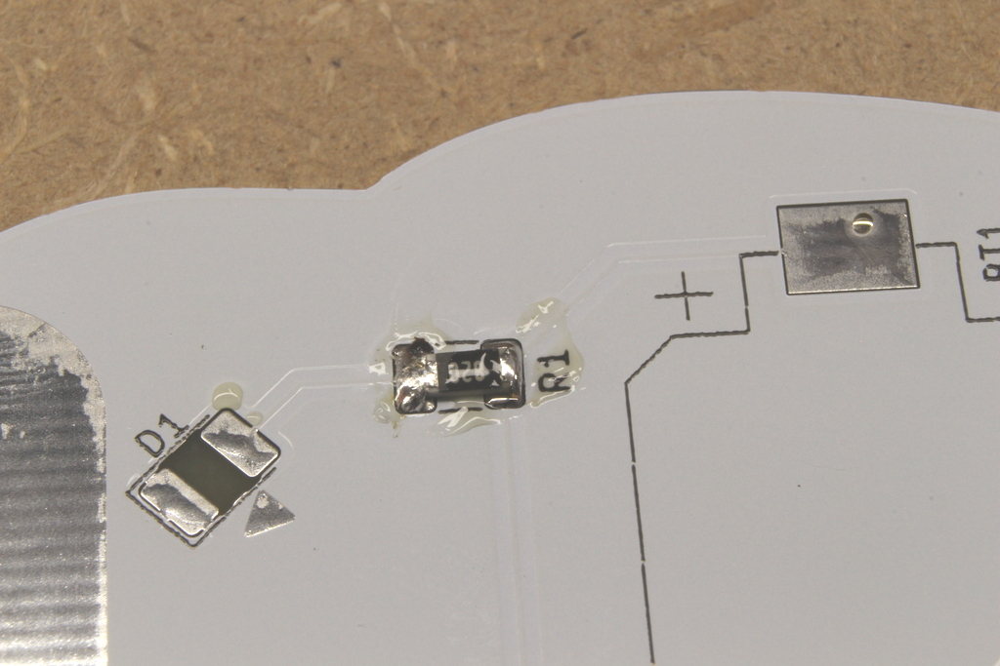

  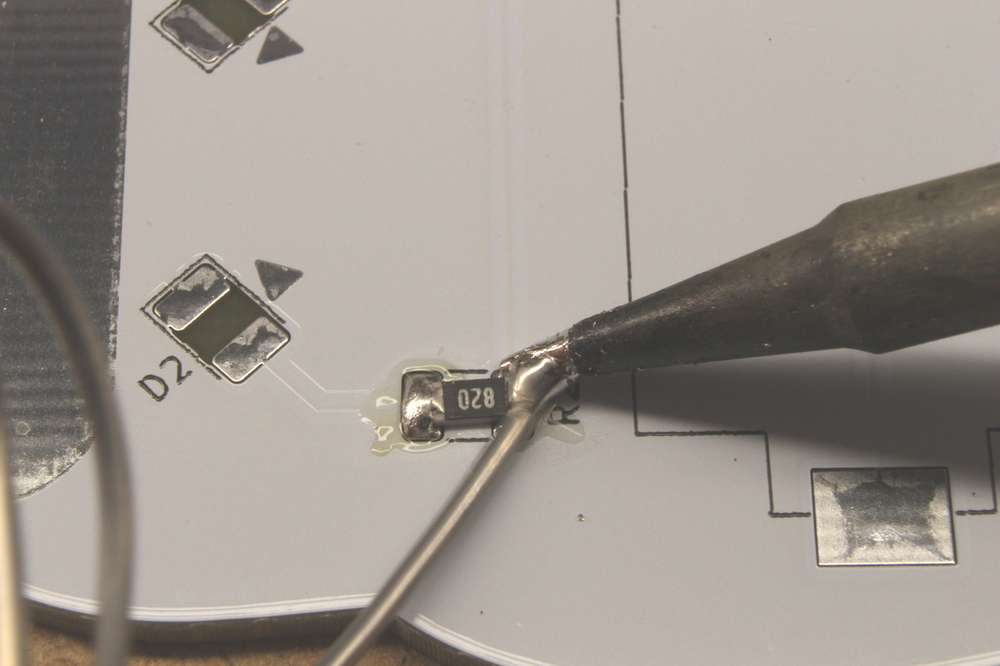
  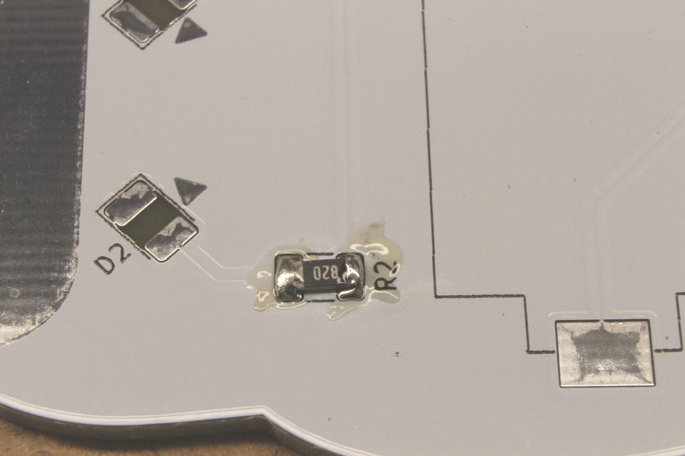

## LEDs - D1 und D2

### Auspacken

Nun musst du die beiden LEDs aus dem Plastikgurt heraus holen.

  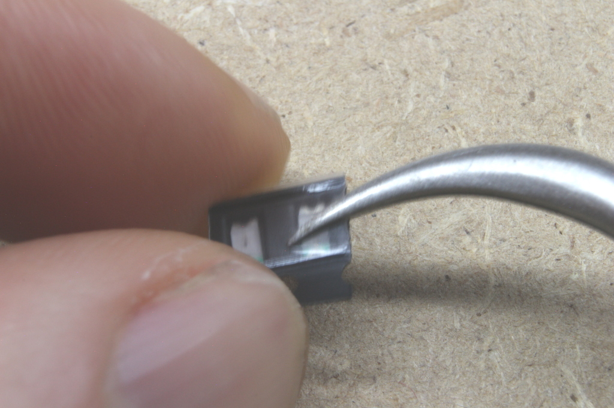
  

Die LEDs haben einen Pfeil, der anzeigt in welcher Orientierung sie aufgelötet werden müssen.

  

### Vorverzinnen

Verzinne ein Pad von D1.

  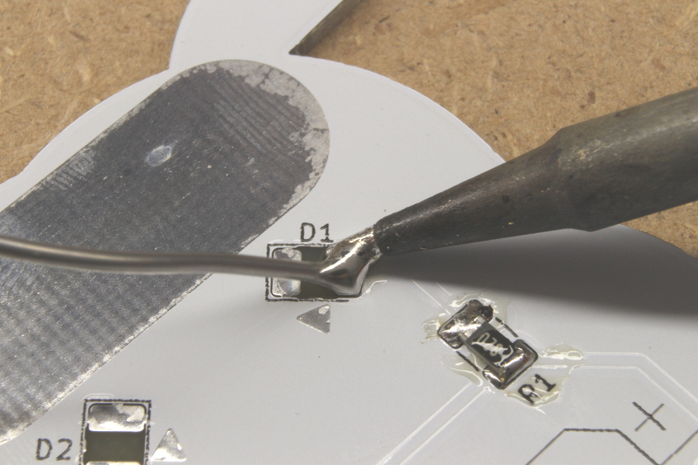
  

Das Gleiche machst du bei D2.

  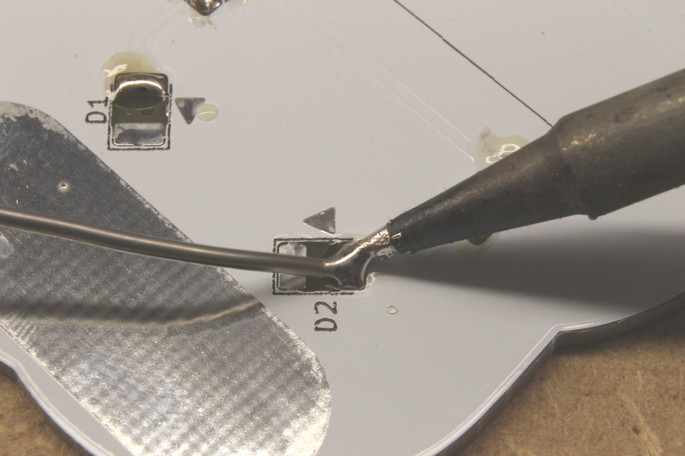
  

### Bauteile platzieren

Da wir die LEDs "auf dem Kopf" auflöten, geht das ein bisschen schwieriger als bei den Widerständen, vom Prinzip ist es aber das Gleiche. Befestige zuerst D1.

  
  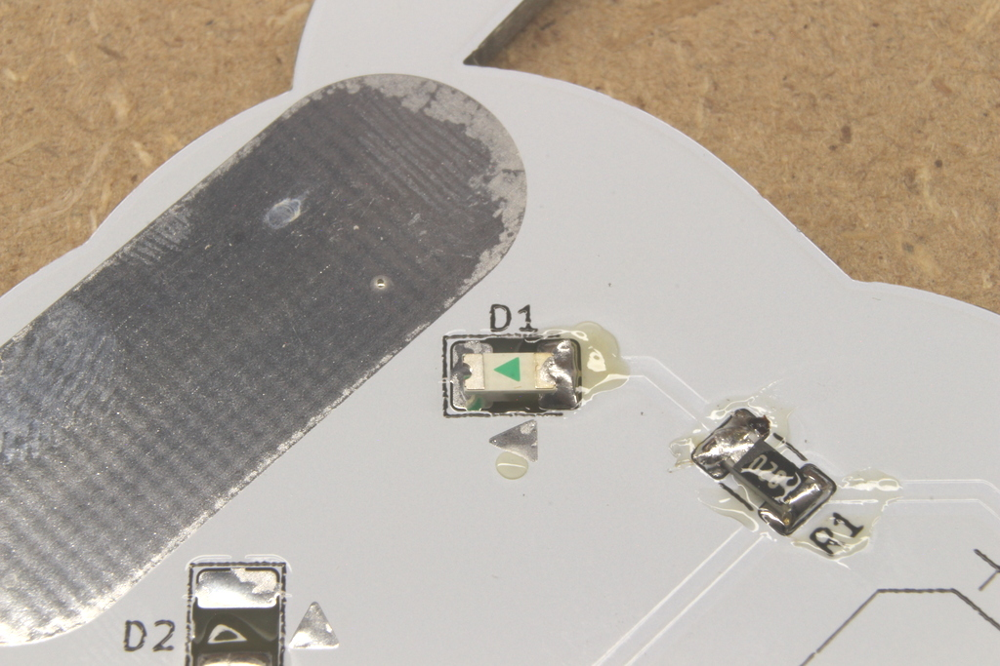

Das Gleiche wiederholst du für D2.

  
  

### Bauteile festlöten

Verlöte jetzt die andere Seite von D1 und D2

  
  

  
  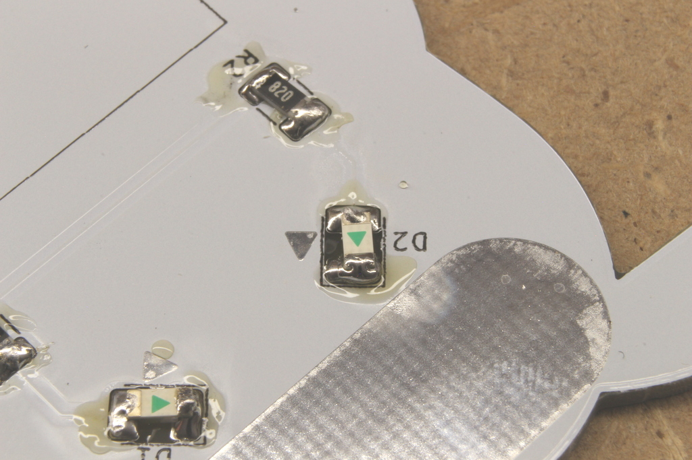

## Schiebeschalter - SW1

### Vorverzinnen

Verzinne exakt nur ein Pad von SW1. Wirklich. Nur eins.

  
  

### Bauteil platzieren

Nimm den Schalter wie gehabt mit der Pinzette. Schmelze das Lötzinn auf und schiebe den Schalter mit einem Beinchen in das flüssige Lötzinn.

  
  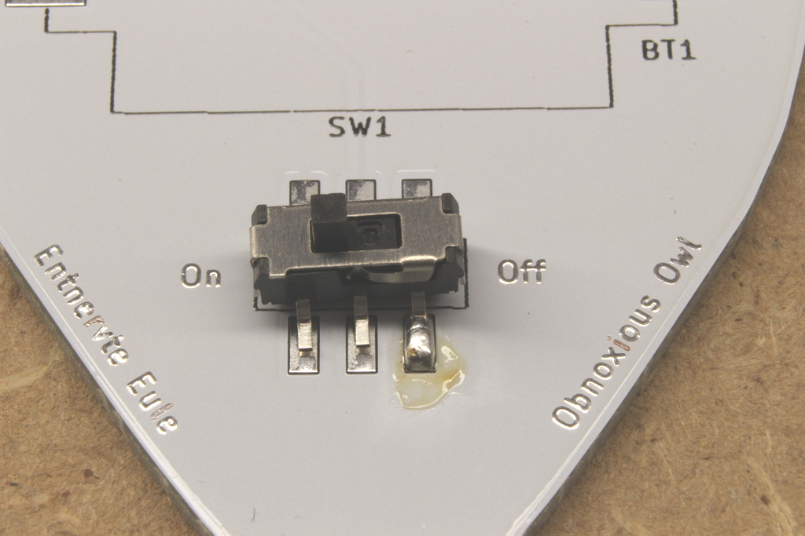

### Bauteil festlöten

Befestige die restlichen Beinchen

  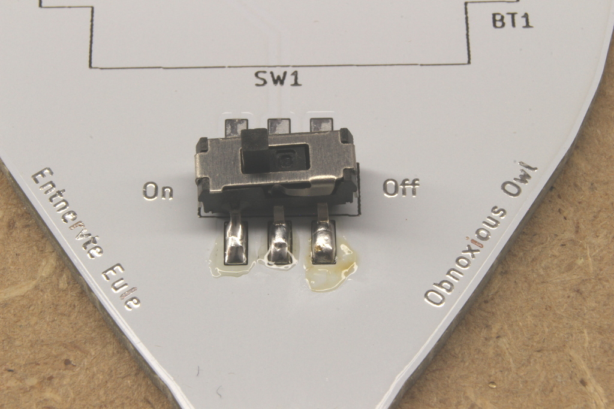
  

## Knopfzellenhalter - BT1

### Vorverzinnen

Verzinne ein Pad des Knopfzellenhalters

  
  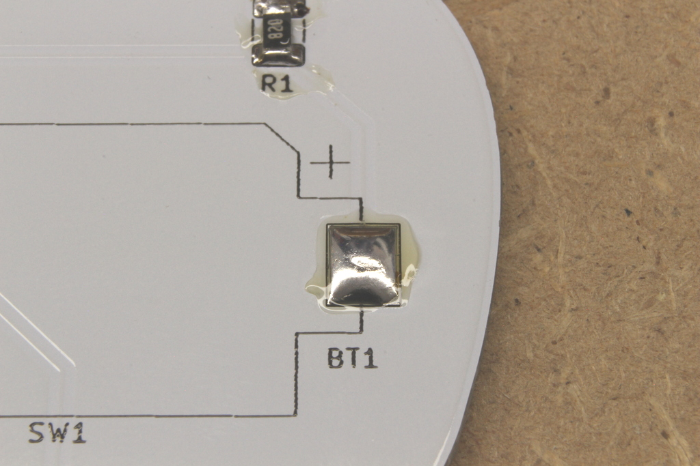

### Bauteil platzieren

Den Knopfzellenhalter kannst du mit der Hand platzieren.
Drücke mit der Lötkolbenspitze auf das Metallfähnchen bis das darunter liegende Lötzinn aufgeschmolzen ist und der Halter einsinkt.

  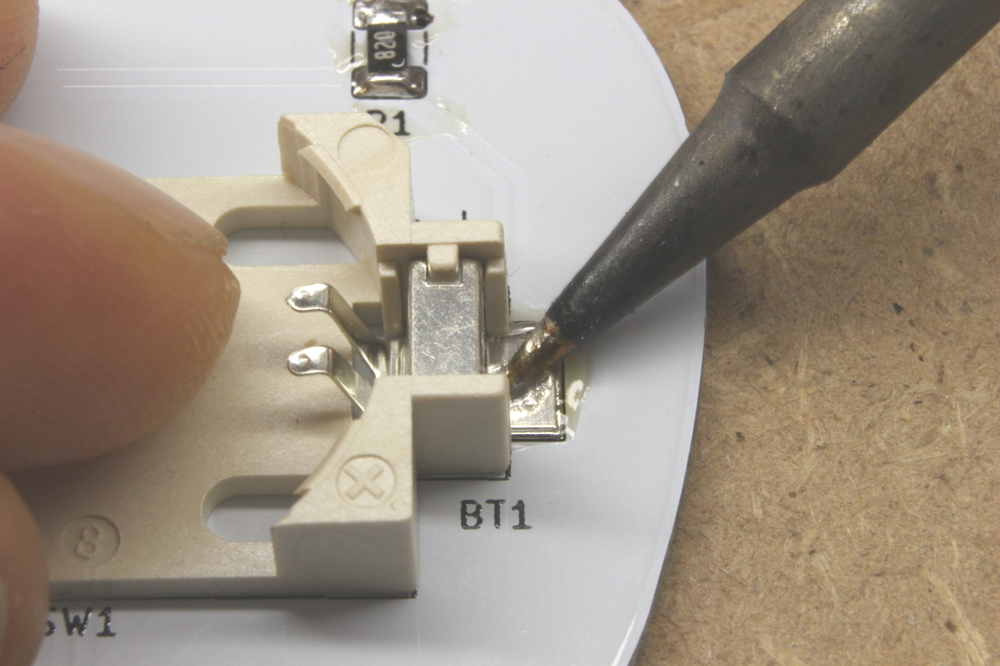

### Bauteil festlöten

Verlöte die zweite Lötfahne des Knopfzellenhalters.

  

## Knopfzelle

### Auspacken

Entferne das Kreppband von der Knopfzelle.

  
  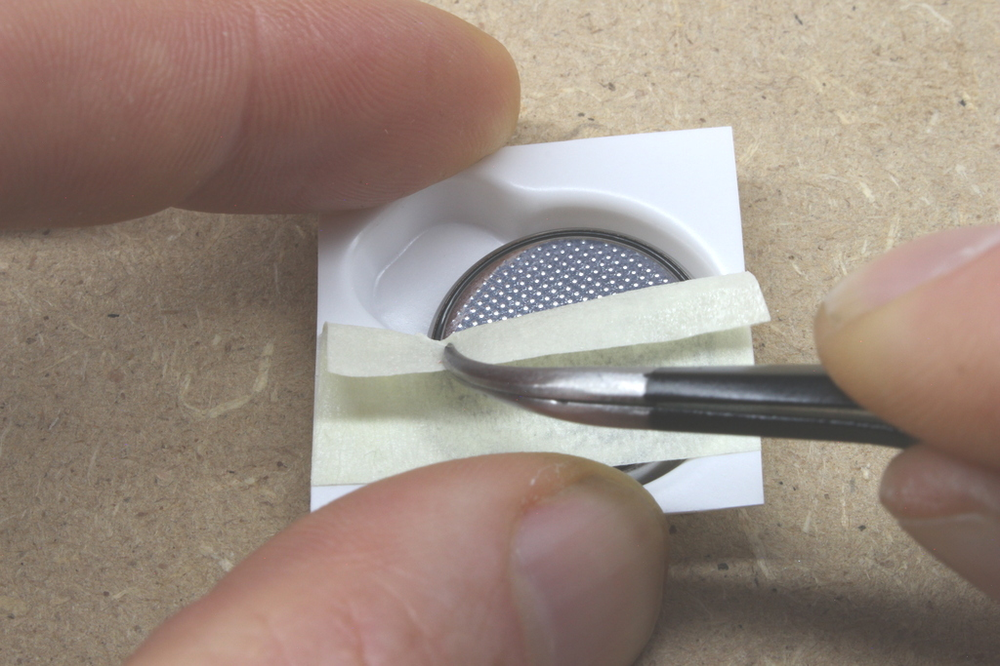

### Einlegen

Lege die Knopfzelle mit der glatten Seite nach oben in den Knopfzellenhalter ein. Achte darauf, dass die Knopfzelle unter den kurzen Metallkontakten ist und drücke sie mit dem Daumen ein, bis sie einrastet.

  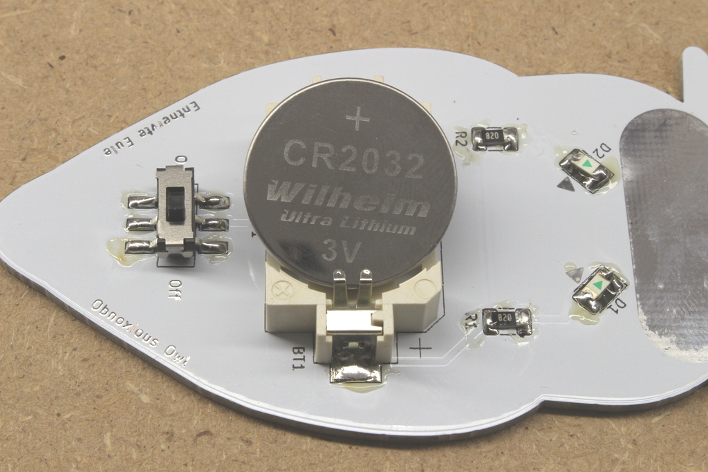
  

  

### Anschalten und ausprobieren

Wenn du den Schalter auf On stellst, sollten beide LEDs leuchten.

  
  

